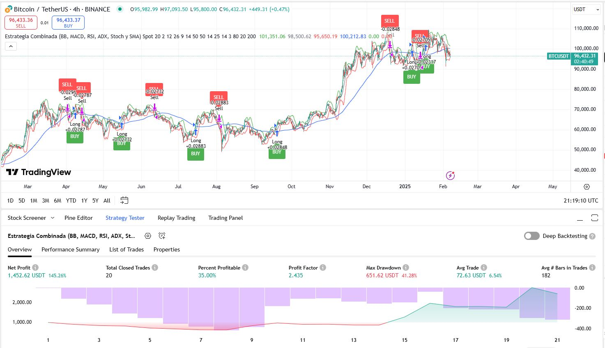

# Trading Bot - MACD, RSI, ADX, Estocástico, Bollinger Bands y SMA. 🚀
## Estrategia con Indicadores Técnicos Clásicos

Este repositorio implementa un bot de trading en BTC utilizando diversos indicadores técnicos. A continuación, se presenta un breve resumen de cada uno:

- **MACD (Moving Average Convergence Divergence):**  
  Es un indicador de momentum que muestra la relación entre dos medias móviles. Se utiliza para identificar cambios en la tendencia y generar señales de compra o venta a través de la convergencia y divergencia de sus líneas.

- **RSI (Relative Strength Index):**  
  Es un oscilador de momentum que mide la velocidad y el cambio de los movimientos de precio. Oscila entre 0 y 100, ayudando a identificar condiciones de sobrecompra (valores altos) o sobreventa (valores bajos).

- **ADX (Average Directional Index):**  
  Mide la fuerza de una tendencia sin importar su dirección. Valores altos indican una tendencia fuerte, mientras que valores bajos sugieren que el mercado se mueve lateralmente. Suele usarse junto con DI+ y DI- para determinar la dirección del movimiento.

- **Estocástico:**  
  Compara el precio de cierre de un activo con su rango de precios durante un período determinado. Ayuda a detectar condiciones de sobrecompra o sobreventa, generando señales cuando el precio se acerca a los extremos del rango.

- **Bollinger Bands:**  
  Consiste en una media móvil central rodeada por dos bandas, que se sitúan a una o dos desviaciones estándar por encima y por debajo de la media. Estas bandas se ajustan según la volatilidad del mercado, ayudando a identificar posibles reversiones de tendencia.

- **SMA (Simple Moving Average):**  
  Es la media aritmética de los precios durante un período específico. Se utiliza para suavizar la acción del precio y detectar tendencias a largo plazo, eliminando parte del "ruido" del mercado.

---

## 📁 Contenido

- **dataset/**:  
  📊 Datos históricos de BTC en distintos timeframes (1D, 1H, 4H y 15min) (2018–2025).

- **backtest.py**:  
  🧪 Código para realizar el backtesting de la estrategia.

- **bot.py**:  
  🤖 Implementación del bot de trading.

---

## 📊 Información del Dataset

Cada archivo CSV contiene los siguientes campos:

- **Open time**: ⏰ Fecha y hora de inicio del período (vela).
- **Open**: 💲 Precio de apertura.
- **High**: 📈 Precio más alto alcanzado durante el período.
- **Low**: 📉 Precio más bajo alcanzado durante el período.
- **Close**: 🔒 Precio de cierre.
- **Volume**: 📊 Volumen de la criptomoneda operada.
- **Close time**: ⏲ Hora de cierre del período.
- **Quote asset volume**: 💰 Volumen total en la moneda cotizada.
- **Number of trades**: 🔢 Número de transacciones realizadas.
- **Taker buy base asset volume**: 📥 Volumen del activo base comprado por los 'takers'.
- **Taker buy quote asset volume**: 📤 Volumen en la moneda cotizada correspondiente a las compras de 'takers'.
- **Ignore**: 🚫 Columna reservada (sin uso relevante).

---

## ⚙️ Requerimientos

- **Python 3.7+**
- **Librerías de Python:**
  - [pandas](https://pandas.pydata.org/)
  - [numpy](https://numpy.org/)

Puedes instalarlas ejecutando:
```bash
pip install pandas numpy
```

## 📊 Resultados

Criptomoneda: BTC
Capital inicial : 1000$
Capital en cada trade: 100%
Timeframe: 4h

💵 PnL Acumulado: 10142.10 USDT
🔄 Total Operaciones: 136
    ✅ Ganadoras: 39
    ❌ Perdedoras: 29
🎯 Win Rate Global: 57.35%
📈 Avg Win: 324.62 USDT
📉 Avg Loss: -86.83 USDT
💹 Returns Global: 126.78%


## Tradingview PineScript


